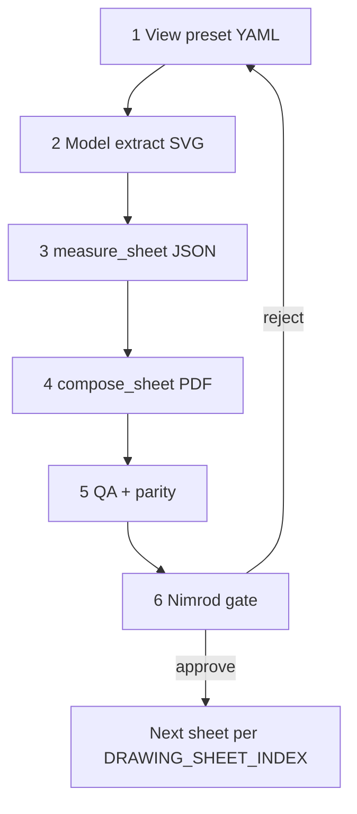

> **Provenance:** harvested verbatim from `IsraelMicrogreens-BlenderV2-Project` on 2026-07-08 — Sadot `design/` canon bootstrap (WP: `SDT-S001-P001-WP001`, architectural-drawing-canon + Blender/geo pipeline harvest).

# 03 — Process workflow (six stages)

**Binding workflow** for every field-execution sheet. Visual: `drawings/process/MODEL_NATIVE_PROCESS.pdf`.

## Stage detail

| Stage | Input | Action | Output | Gate |
|-------|-------|--------|--------|------|
| **1** | Sheet ID from `DRAWING_SHEET_INDEX.yaml` | Author `view_presets/<ID>.yaml` — crop, collections, cuts, scale | YAML in repo | Preset reviewed |
| **2** | Live `.blend` + preset | `export_sheet_views.py` — **section/elevation → Section Toolbox** (BVH HLR + cut poché + DXF); **plan of a roofed structure → horizontal cut plane** at stated height (never top-projection through the roof); open-site plan → enhanced mesh fallback. Must enforce preset collection+prefix filters. | `drawings/_extracts/<ID>/*.svg`\|`.dxf` | Log in `logs/drawing/`; obey output-quality contract (`MODEL_NATIVE_DRAWING_STANDARD.md` §3a) |
| **3** | Object list in preset | `measure_sheet.py --sheet <ID>` | `exports/ai_bridge/sheet_measurements_<ID>.json` | No missing objects |
| **4** | Extracts + JSON | `compose_sheet.py` — vectors + dims + title block | `drawings/<folder>/*.pdf` | English, mm, no TBD |
| **5** | PDF folder | `sheet_qa_checklist.py`, `sheet_model_parity.py`, **visual QA gate** (§ below), viewport compare | `QA_PASS`, `PARITY_PASS`, `VISUAL_PASS` | Cross-engine validator |
| **6** | PDF | Nimrod review | Row in `APPROVAL_LOG.md` | Verbatim quote |

## Stage 5 — mandatory visual QA gate (binding)

Script QA alone is **not sufficient** — Team 90 v1.0.0 showed a sheet can pass `sheet_qa_checklist.py`
while having visible label/title-block overlaps and an unreadable dense plan. Before any sheet reaches
the Nimrod gate, the following **visual** checks must pass and be recorded as `VISUAL_PASS`:

| Check | Rule | Fail = block |
|-------|------|--------------|
| **Render the PDF to raster** | Render every sheet PDF to PNG (~150 DPI) and actually inspect it — never gate on SVG line-count alone | yes |
| **No element overlap** | Title block, legend, labels, parts index, and view zones must not overlap | yes |
| **Plan density** | Plan/section extract must use hidden-line removal + preset collection filtering; extract entity count must be under the canon threshold (see `MODEL_NATIVE_DRAWING_STANDARD.md` output-quality contract) | yes |
| **Contractor legibility** | A reviewer must be able to trace every primary dimension and part balloon at print scale | yes |
| **Cut marks / detail refs** | Section cut marks and detail bubbles present and consistent | yes |

Record the rendered PNG + a one-line `VISUAL_PASS`/`VISUAL_FAIL` verdict alongside `QA_PASS`. A weak
engine must run this gate mechanically — it is the safeguard that makes any engine's output reliable.

## Frozen / retired paths

| Path | Status |
|------|--------|
| `make_C4_reservoir.py` hand-reconstruction | **FROZEN** — use P-101 model-native |
| `make_contractor_drawings.py` `plx()`/`ply()` | **Retired pattern** — layout reference only |
| Blender screenshot as primary view | **Forbidden** |

## Production order (this project)

See `DRAWING_SHEET_INDEX.yaml` `production_order`. Current: **P-101** → A-101 → …

## Minimum time

≥ **60 minutes** per sheet (measure + extract + compose + visual verify).

## When blocked

| Condition | Action |
|-----------|--------|
| Object missing in model | STOP — do not invent geometry |
| Dimension not in JSON or vendor spec | `OPEN_QUESTIONS_<sheet>.md` |
| External blocker (R1b, R2, Reuven) | PROVISIONAL banner on sheet — do not guess |
